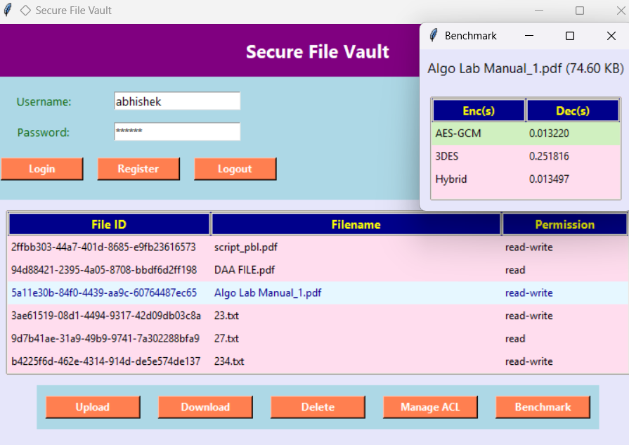

# 🔐 Secure File Vault App

A **Secure File Vault** application built using **Python**, **Tkinter** (for GUI), **SQLite** (for user and file management), and **AES encryption** (for file security).

---

## 🚀 Features

- 🔐 **User Authentication** (Sign up / Login)
- 🗂️ **Upload & Download Encrypted Files**
- 🧾 **Set Access Control (Read / Read-Write)**
- 🗑️ **Delete Files (owner-only)**
- 📊 **View Uploads & File Access History**
- 🧠 **AES Encryption/Decryption Benchmark**
- 🖼️ Clean and intuitive **Tkinter-based GUI**

---

## 📸 Interface Preview



> *Screenshot of the main interface.*

---

## 🛠️ Technologies Used

- **Frontend**: Tkinter (Python GUI library)
- **Backend**: Python + SQLite
- **Encryption**: AES (from `Crypto.Cipher`)
- **Others**: `os`, `tkinter.filedialog`, `hashlib`, `datetime`

---

## ⚙️ Installation

1. **Clone the Repository**
   ```bash
   git clone https://github.com/YOUR_USERNAME/secure-file-vault.git
   cd secure-file-vault
2. **Install Required Libraries**

   pip install pycryptodome
   Run the Application

**📁 File Structure**
bash
Copy
Edit
secure-file-vault/
├── pbl.py             
├── interface.png      
├── README.md         
└── database.db       

**🔒 Security Note**
AES keys are securely hashed.

Users can only view/edit/delete their own files.

Access control ensures that only permitted actions can be performed.

